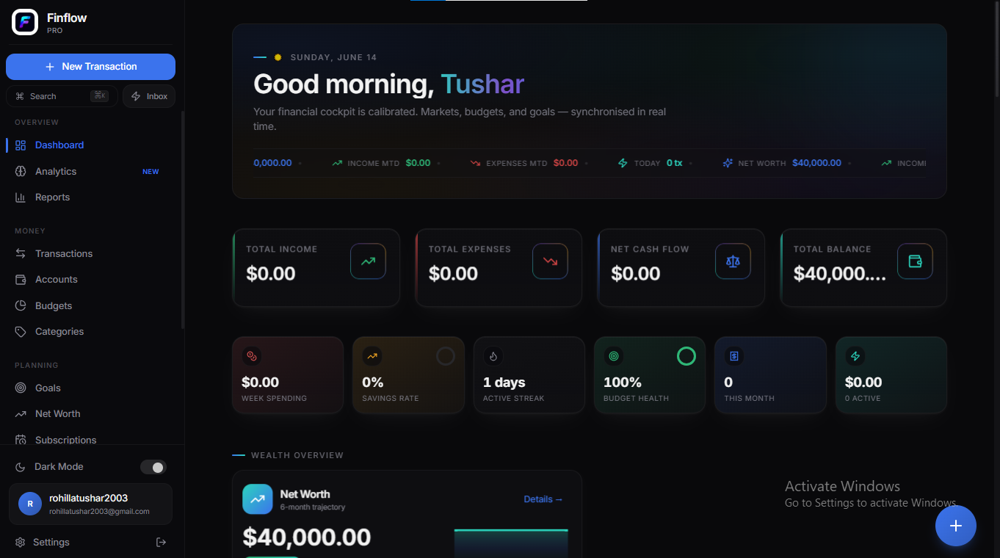

#  Finflow  
**A smart, AI-powered personal finance management platform**

<!--
🖼️ HERO IMAGE / DEMO GIF PLACEHOLDER
Add a dashboard screenshot or short demo GIF showing transactions, charts, or AI advisor in action.
Suggested path: /assets/hero.png or /assets/demo.gif
-->

Finflow is a modern personal finance management application designed to help users **track expenses, manage budgets, and gain actionable financial insights**. Built with a polished, responsive interface and enhanced by AI-driven features, Finflow goes beyond simple expense tracking to offer a holistic view of financial health.

---

## 📌 Project Overview

Finflow acts as a **centralized hub for personal finance**, allowing users to monitor transactions, visualize spending habits, manage budgets, track subscriptions, and work toward savings goals—all in one place.

An integrated **AI Financial Advisor** and **AI Receipt Scanner** elevate the experience by providing personalized insights and automating expense entry. The application is built as a responsive **single-page web application (SPA)**, ensuring a seamless experience across devices.

**Project Type:** Personal finance management SPA  
**Target Audience:** Individuals seeking clarity, control, and insights into their personal finances  

---

## ✨ Key Features

<!--
🎬 FEATURE SHOWCASE GIF PLACEHOLDER
Add a GIF showing transaction entry, charts updating, or AI advisor interaction.
-->

### 💰 Financial Tracking
- Add, edit, and manage income, expenses, and transfers  
- Categorize transactions dynamically  
- Track balances across multiple account types (bank, cash, credit card, investments)

### 📊 Budgeting & Insights
- Create category-based budgets with rollover support  
- Visualize spending patterns and trends  
- Generate financial reports with interactive charts  
- Monitor an overall **Financial Health Score**

### 🎯 Goals & Subscriptions
- Define and track financial goals with progress indicators  
- Manage recurring subscriptions and upcoming bills  
- View financial events in a calendar-style interface

### 🤖 AI-Powered Features
- **AI Financial Advisor:** Personalized financial advice via chat  
- **AI Receipt Scanner:** Automatically extracts transaction details from receipts  

### 🔐 User Experience
- Secure authentication using Supabase Auth  
- Light and dark theme support  
- Responsive layout for desktop and mobile  
- Smooth animations and transitions

---

## 🧠 Technical Stack

### Frontend
- **React** – Component-based UI development  
- **TypeScript** – Type safety and maintainability  
- **Vite** – Fast development and build tooling  
- **Tailwind CSS** – Utility-first styling  
- **shadcn/ui** – Accessible, reusable UI components  
- **Framer Motion** – Smooth UI animations  
- **React Router DOM** – Client-side routing  
- **TanStack Query (React Query)** – Data fetching, caching, and synchronization  
- **Recharts** – Interactive financial data visualizations  
- **date-fns** – Date utilities  
- **next-themes** – Theme management

### Backend & Infrastructure
- **Supabase**
  - PostgreSQL database
  - Authentication
  - Edge Functions for AI features

### AI Integration
- Supabase Edge Functions powering:
  - AI Financial Advisor
  - AI Receipt Scanner (LLM-backed)

### Tooling & Quality
- ESLint  
- TypeScript ESLint  
- Prettier (via editor configuration)

---

## 🚀 Getting Started

### Prerequisites
- Node.js (v16 or higher)
- npm (recommended via nvm)
- A Supabase project

---
### 🏠Dashboard


---

### ⚙️ Installation

1.Clone the repository:
```bash
git clone https://github.com/<your-username>/papelflow.git
cd papelflow
```

2. Install Dependencies:
```bash
npm install
```

3.Create a .env file in the root directory:
```bash
VITE_SUPABASE_URL="YOUR_SUPABASE_PROJECT_URL"
VITE_SUPABASE_ANON_KEY="YOUR_SUPABASE_ANON_KEY"
VITE_SUPABASE_PUBLISHABLE_KEY="YOUR_SUPABASE_ANON_KEY"

```
4.Start the development server:
```bash
npm run dev

```
5.The app will be available at:
```bash
http://localhost:5173

```
---

## 🏗 Application Architecture

The application boots from /src/main.tsx, mounting the root App component.

- **App.tsx** sets up:

- React Query Provider

- Theme Provider (light/dark mode)

- Authentication Context

- Currency Context

- Routing and protected routes

### Core Modules

- AuthContext – Handles authentication state via Supabase

- ProtectedRoute – Restricts access to authenticated users

- Data Hooks – Custom React Query hooks for accounts, transactions, budgets, goals, and subscriptions

---
## 📊 Insights & Intelligence

Finflow provides advanced insights through:
- Spending forecasts based on habits and upcoming bills
- Smart insights highlighting unusual spending or income changes
- AI-driven financial guidance tailored to user data
- Interactive charts and dashboards for clarity and decision-making


### 🧪 Development Workflow
```bash
npm install
npm run dev
```

Instant reloads via Vite

Linting support:
```bash
npm run lint
```
---
## 🚢 Deployment

Build the production bundle:
```bash
npm run build
```

The compiled assets will be available in the **dist/** directory.
You can deploy using:

- Vercel
- Netlify
-  Lovable

Any static hosting platform

Ensure all environment variables are configured in the deployment environment.

---

## 🤝 Contributing

Contributions are welcome.

1.Fork the repository

2.Create a feature branch
```bash
git checkout -b feature/AmazingFeature
```

3.Commit your changes

4.Push and open a Pull Request

---
## 📄 License

This project is licensed under the MIT License.
See the LICENSE file for details.

Finflow is built with a focus on clarity, intelligence, and real-world financial needs—combining modern tooling with practical problem-solving.


---
 
AI-driven financial guidance tailored to user data

Interactive charts and dashboards for clarity and decision-making
